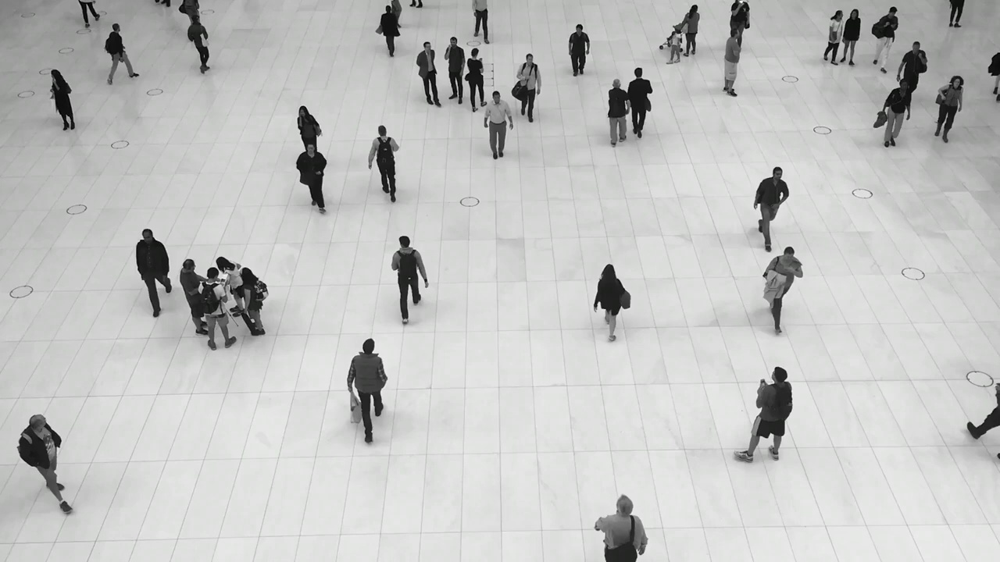
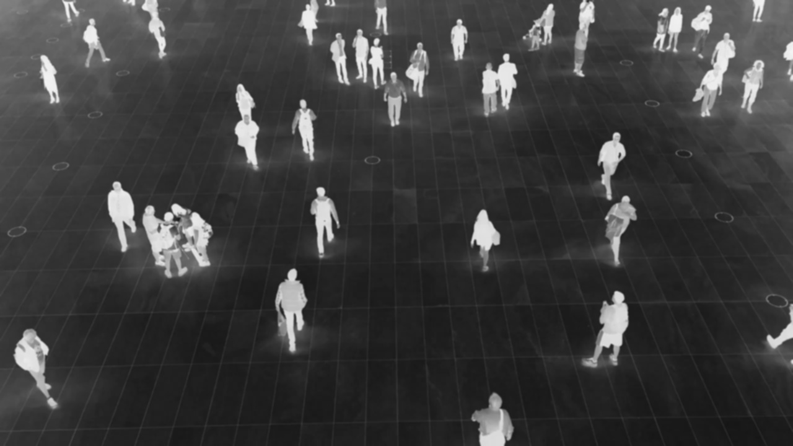

# README

Un problema recurrente en la optimización de Layout (posición de los productos) es generar áreas con mapas de calor que representan el flujo de clientes, esta información es útil para saber que zonas de la tienda son más concurridas y tiene un mayor flujo de personas de manera tal de posicionar los productos de mayor valor para en negocio en esa zona y/o reoptimizar en Layout. Este problema es tranversal en mutiples Industrias desde Retail, Centros Comerciales hasta un Casino.

Este repositorio tiene 3 Jupyter Notebooks que representan un desarrollo incremental de un proyecto final que permite detectar y contar la cantidad de personas e identificar zonas de interes con un heat map a partir de una RestNet pre entrenada.

Repositorio creado en Python 3.8.3 y YOLOV4 3.2.0

**Video/Imagen**

**Object Detection**

**Filtro Gaussiano**

**Heat Map**

**Referencias**

- https://discuss.pytorch.org/t/adjust-prediction-layer-of-maskrcnn-resnet50-fpn-for-transfer-learning-and-fine-tuning/149955
- https://towardsdatascience.com/yolo-object-detection-with-opencv-and-python-21e50ac599e9

